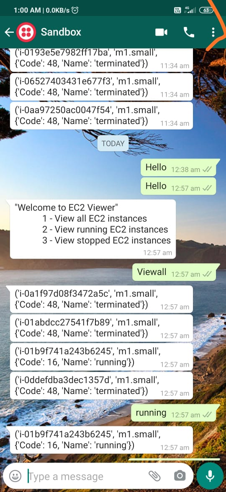

# Hop-Bot
DOCKER: Control your basic docker operations using Whatsapp (twilio's Whatsapp API)
        <li> 1. List Containers
        <li> 2. Stop a Container
        <li> 3. Run a Container
        <li> 4. Remove a container Instance

EC2BOT: Control your basic operations through whatsapp 
        <li> 1. View all Instances
        <li> 2. Running Instances
        <li> 3. Stop Instances
                
                
                
   
        
          
         
 
